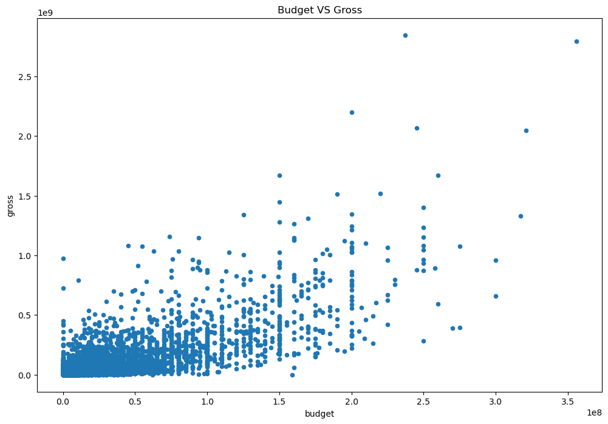
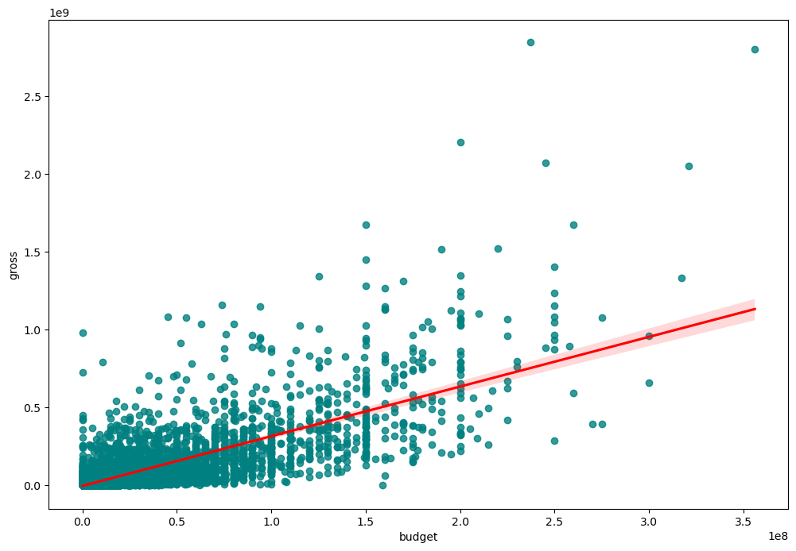
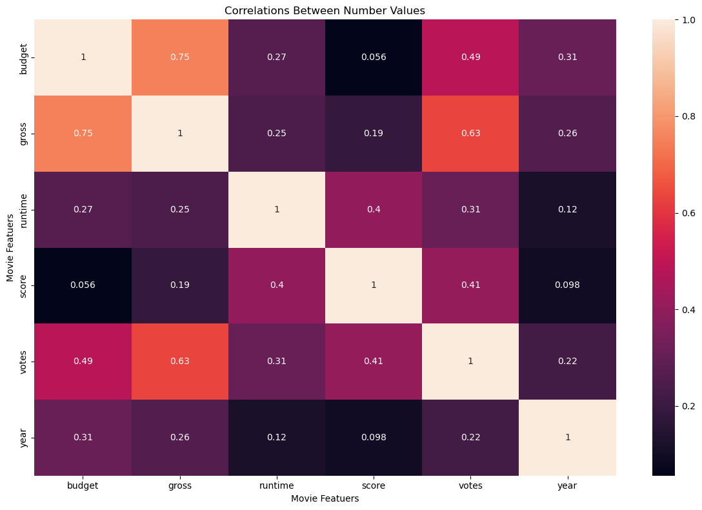

# Introduction

### This project leverages the power of SQL, Tableau, and Python to provide insightful data visualizations and analyses.

## Overview

### In today’s data-driven world, the ability to extract meaningful insights from complex datasets is crucial. This project demonstrates how to use SQL for efficient data querying, Tableau for dynamic visualizations, and Python for data manipulation and automation. Together, these tools create a robust framework for analyzing and presenting data effectively.

## Key Features

- SQL Queries: Efficiently extract and manipulate data from relational databases.
- Tableau Dashboards: Create interactive and visually appealing dashboards to present key findings.
* Python Scripts: Automate data processing tasks and enhance the analysis workflow.

## Feel free to give me your feedback for all my project and where i should improve my skills and work.


# SQL 

## First i used SQL for Data Exploratian and Data Cleaning using Postgres SQL

### I used 2 data sets
- Covid-19
- Nashville data housing

``` sql
SELECT 
    location,
    date,
    total_cases,
    new_cases,
    total_deaths,
    population
FROM
    covid_deaths;


-- Total Cases VS Total Deaths in US OR any Country of your choice
SELECT 
    location,
    date,
    total_cases,
    total_deaths,
    ROUND((total_deaths / total_cases) * 100, 4) AS death_rate 
FROM
    covid_deaths
WHERE
    location = 'United States'
ORDER BY 1 ,2;

```


``` sql

-- Breaking out the owner address

SELECT 
    owneraddress,
    SPLIT_PART(owneraddress,',',1) AS address_before_comma,
    SPLIT_PART(owneraddress,',',2) address_after_comma,
    SPLIT_PART(owneraddress,',',3) AS address_after_after_comma
FROM 
    nashville_housing_data;

ALTER TABLE 
    nashville_housing_data
ADD 
    ownersplitaddress VARCHAR(255);

ALTER TABLE
    nashville_housing_data
ADD
    ownersplitcity VARCHAR(255);

ALTER TABLE
    nashville_housing_data
ADD
    ownersplitstate VARCHAR(255);

UPDATE 
    nashville_housing_data
SET 
    ownersplitaddress = SPLIT_PART(owneraddress , ',',1);

UPDATE
    nashville_housing_data
SET
    ownersplitcity = SPLIT_PART(owneraddress , ',', 2);

UPDATE 
    nashville_housing_data
SET
    ownersplitstate = SPLIT_PART(owneraddress ,',',3);

```


# Tableau

## I used Tableau after finishing cleaning to visualize
- Total Cases accross the world
- Death Count
- Infection rate
- Infection Percent for selected Countries

## Link for my dashboeard 
https://public.tableau.com/app/profile/ahmed.takeyeldeen/viz/Virus_Dashboard/Dashboard1?publish=yes


# Python

## Budget vs Gross Scatter Plot

### Overview
This Python script creates a scatter plot to visualize the relationship between the budget of movies and their gross earnings. It uses the Pandas library for data manipulation and Matplotlib for plotting.

``` python
df.plot(kind='scatter' ,x='budget',y='gross')
plt.title('Budget VS Gross')
plt.show()
```



### Another scatter plot but more easy to understand using line to split the plot

``` python
sns.regplot(x='budget', y='gross', data=df ,scatter_kws={'color':'teal'},line_kws={'color':'red'})

```



### Movie Features Correlation Heatmap
This Python script generates a heatmap to visualize the correlations between various numerical features of movies, such as budget, gross earnings, runtime, score, votes, and year. It uses the Pandas library for data manipulation, Seaborn for visualization, and Matplotlib for plotting.

``` python
df_corr = df[['budget','gross','runtime','score','votes','year']]

new_corr= df_corr.corr(method='pearson')
sns.heatmap(new_corr,annot=True)

plt.title('Correlations Between Number Values')

plt.xlabel('Movie Featuers')
plt.ylabel('Movie Featuers')
plt.tight_layout()

plt.show()
```

